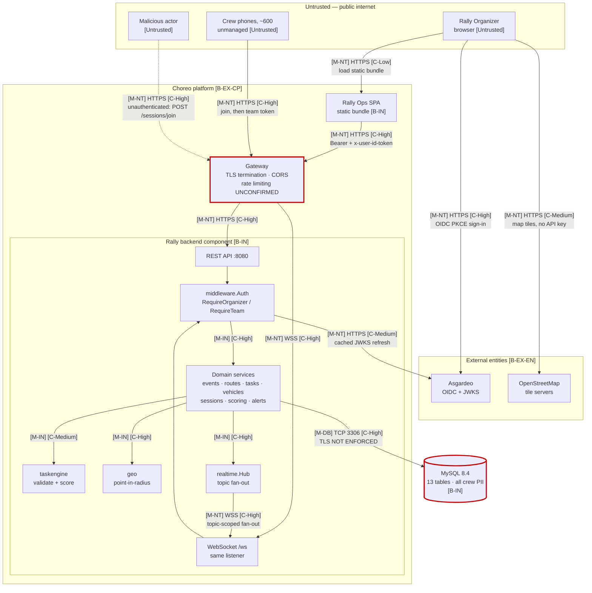
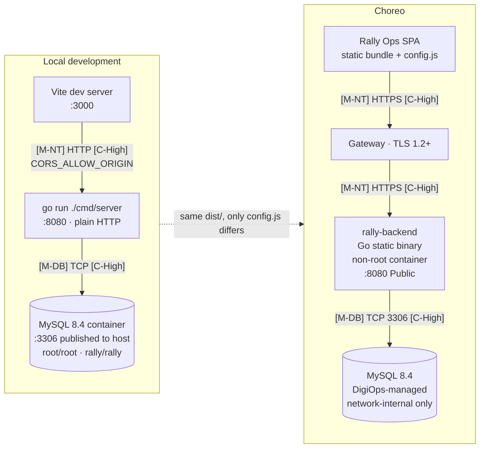
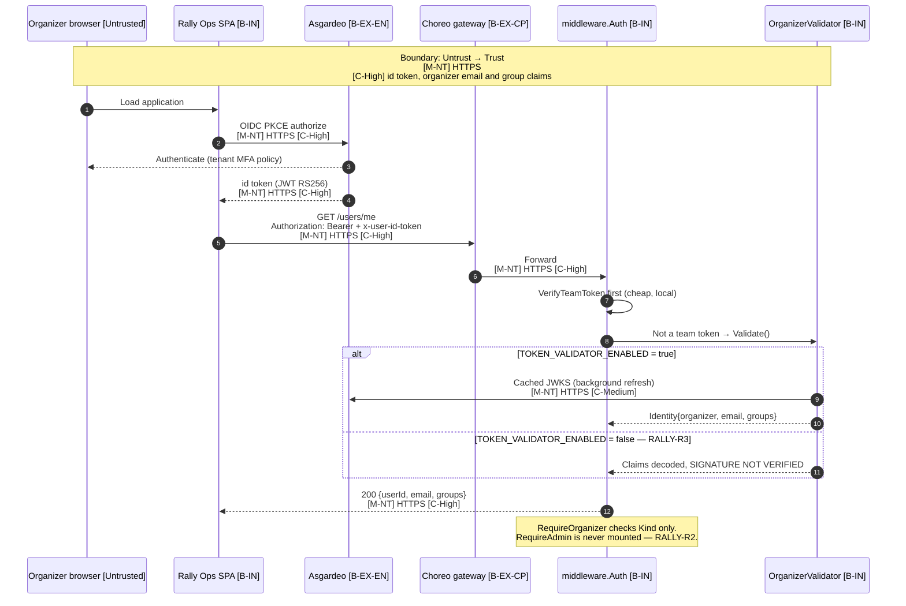
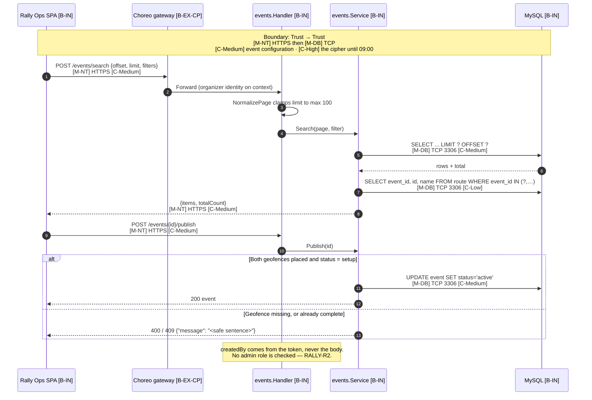
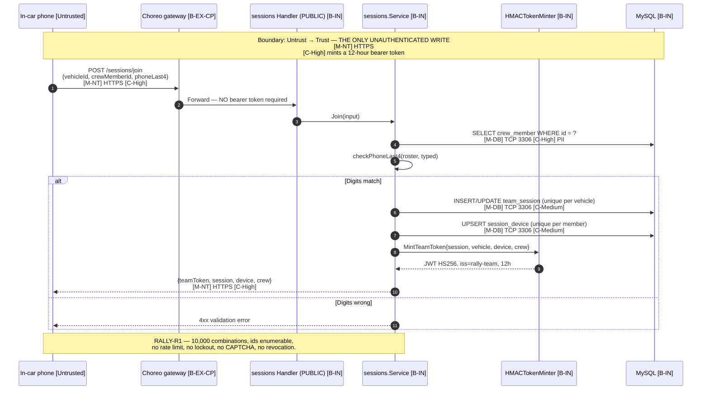
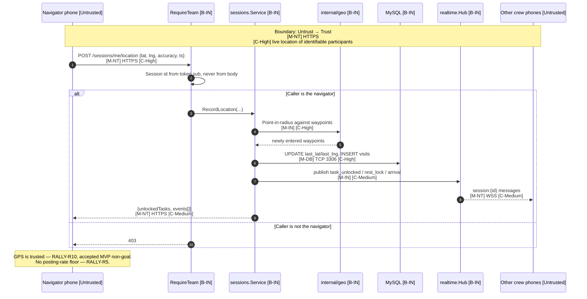
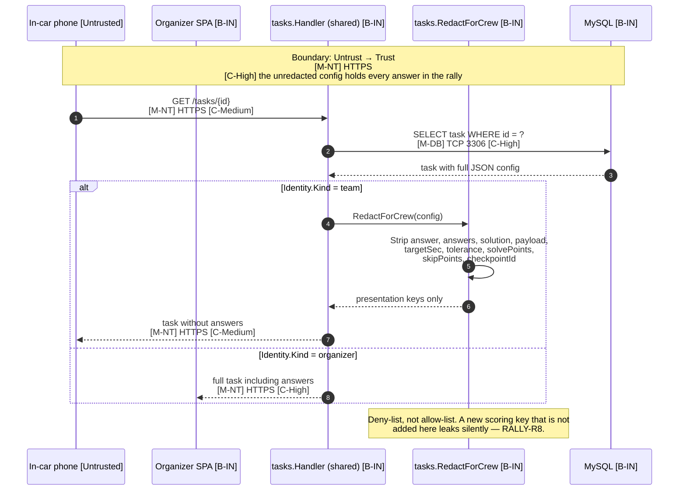
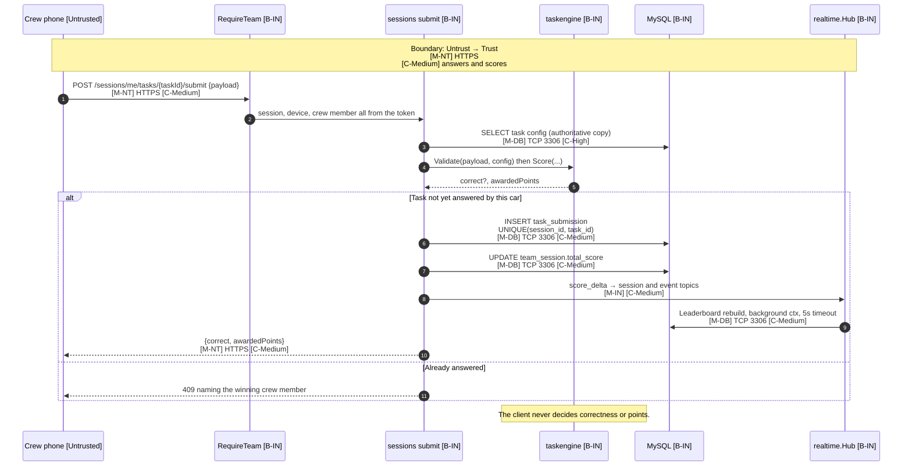
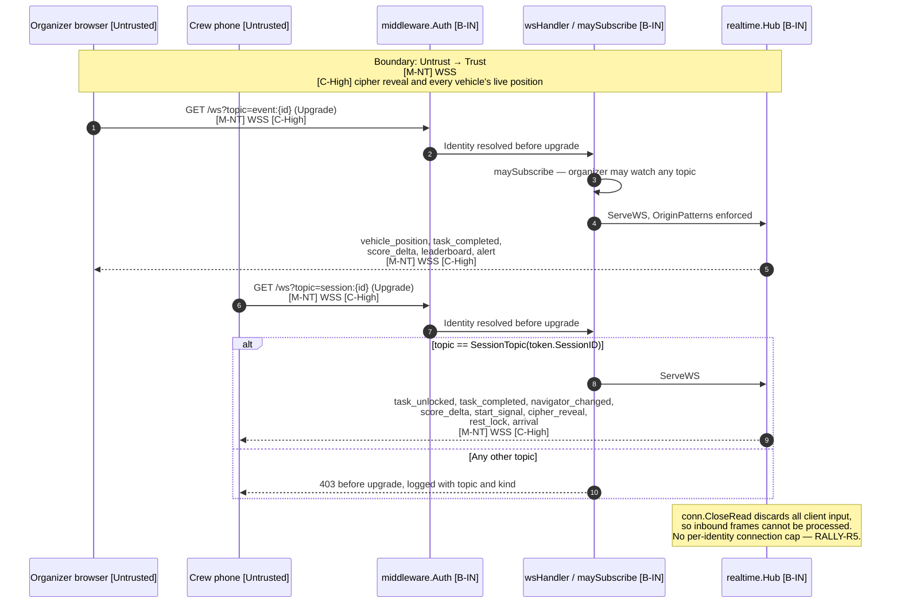
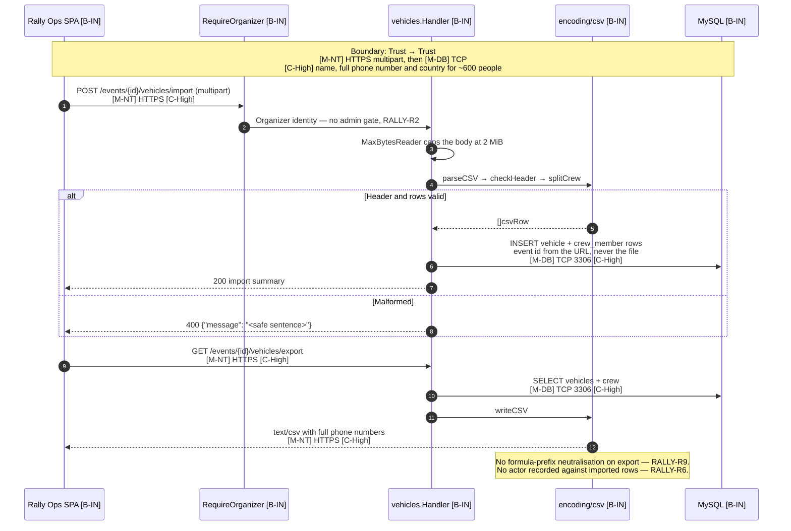

# WSO2 Motor Rally 2027 — Architecture and Data Flow Diagrams

Companion to `WSO2 Motor Rally 2027 - Threat Model.docx`. Each DFD number below
matches the interaction number in that document.

**Scope note.** The Go backend and the organizer web app are drawn as
implemented (branch `feat/webapp-events`, commit `81dee73`). The in-car micro
app is drawn as designed in `docs/specs/2026-07-24-wso2-motor-rally-design.md` —
it has no implementation yet, so DFDs 3 through 7 describe intended behaviour on
the client side and implemented behaviour on the server side.

## Notation

| Boundary | Meaning |
|---|---|
| `[Untrusted]` | Untrusted entity — internet users, unmanaged participant devices |
| `[B-EX-EN]` | External entity — external APIs, IDPs, third-party systems |
| `[B-EX-DP]` | External dependency |
| `[B-EX-CP]` | External component, code owned by WSO2 |
| `[B-IN]` | Internal boundary |

| Medium | Meaning | | Confidentiality | Meaning |
|---|---|---|---|---|
| `[M-NT]` | Network (HTTP/HTTPS/WSS) | | `[C-High]` | Tokens, PII, secrets |
| `[M-DB]` | Database (TCP) | | `[C-Medium]` | Business data, non-PII |
| `[M-FS]` | File system | | `[C-Low]` | Public or non-sensitive |
| `[M-IN]` | Internal, in-process | | | |

---

## 1. High-Level System Architecture

Red-outlined nodes carry an open finding: the gateway because no rate limiting
is confirmed anywhere in the stack (RALLY-R5), the database because the
connection does not currently require TLS.

---

## 2. Container and Deployment Architecture

Local development runs `TOKEN_VALIDATOR_ENABLED=false`, which accepts organizer
tokens **without signature verification** (RALLY-R3). Nothing in `config.Load()`
prevents that value reaching a deployed environment.

---

## DFD 1 — Organizer Authentication and API Access

---

## DFD 2 — Event Administration

---

## DFD 3 — Crew Join and Team Token Issuance

---

## DFD 4 — Location Streaming and Geofence Unlock

---

## DFD 5 — Task Definition Retrieval with Redaction

---

## DFD 6 — Task Submission and Server-Side Scoring

---

## DFD 7 — WebSocket Subscription and Fan-Out

---

## DFD 8 — Vehicle and Crew Roster with CSV Import/Export

---

## Boundary Crossing Summary

| DFD | Interaction | Boundary crossing | Medium | Confidentiality | Open risks |
|---|---|---|---|---|---|
| 1 | Organizer authentication | Untrust → Trust | `[M-NT]` HTTPS | `[C-High]` id token, email, groups | RALLY-R2, R3, R5, R6 |
| 2 | Event administration | Trust → Trust | `[M-NT]` + `[M-DB]` | `[C-Medium]`; cipher `[C-High]` | RALLY-R2 |
| 3 | Crew join | **Untrust → Trust, unauthenticated** | `[M-NT]` HTTPS | `[C-High]` mints a 12h token | **RALLY-R1**, R4 |
| 4 | Location streaming | Untrust → Trust | `[M-NT]` HTTPS | `[C-High]` participant location | RALLY-R5, R7, R10 |
| 5 | Task retrieval | Untrust → Trust | `[M-NT]` HTTPS | `[C-High]` unredacted config | RALLY-R8 |
| 6 | Task submission | Untrust → Trust | `[M-NT]` + `[M-DB]` | `[C-Medium]` answers and scores | RALLY-R5, R11 |
| 7 | WebSocket fan-out | Untrust → Trust | `[M-NT]` WSS | `[C-High]` cipher, all positions | RALLY-R5 |
| 8 | Roster and CSV | Trust → Trust | `[M-NT]` + `[M-DB]` | `[C-High]` PII for ~600 people | RALLY-R2, R6, R7, R9 |
| — | Backend → Asgardeo JWKS | Trust → Untrust | `[M-NT]` HTTPS | `[C-Medium]` public keys | — |
| — | Browser → OpenStreetMap | Trust → Untrust | `[M-NT]` HTTPS | `[C-Low]` tile coordinates | — |
| — | Backend → MySQL | Trust → Trust | `[M-DB]` TCP 3306 | `[C-High]` all data incl. PII | **TLS not enforced** |
